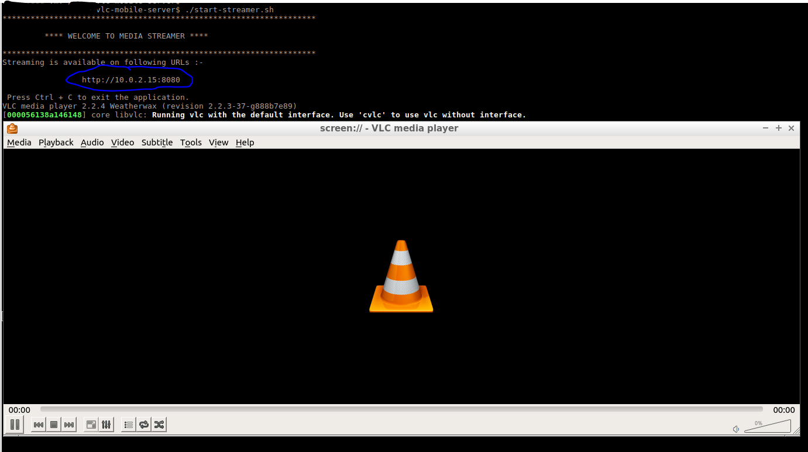
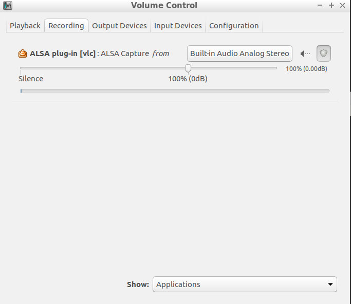

# vlc-mobile-server
A simple script to stream out desktop video to a mobile/tablet.
I use this script to watch videos uninterrupted on different devices at home.

## Prerequisites

Following software modules must be installed in in your laptop to make it a
desktop streaming server. The script is tested on Linux(More specifically, on
  Ubunutu platform.).

* Install VLC and all its componenets. The script uses vlc for stream out the
desktop video.

```
    apt install vlc
    apt install vlc-plugin-access-extra
    apt install vlc-data
    apt install vlc-plugin-base
```

* Install pavucontrol for redirect audio from speaker to the application.

```
  apt install pavucontrol
```

* Setup pavucontrol for audio forwarding. This is achieved by using a virtual
pipe between the speaker output to the application input.

## How to run the application.

* Start stream server by

```
  ./start-streamer.sh
```
If everything configured properly, the application will show the streaming urls.



* Install VLC(I use vlc client in my mobile) in your mobile.

* Access the desktop using the url provided by the server. Please note the mobile
should be on the same network to access the url.

* If there is no sound in the mobile, open 'pavucontrol' and setup the audio output redirect to vlc application at 'Recording' tab.


